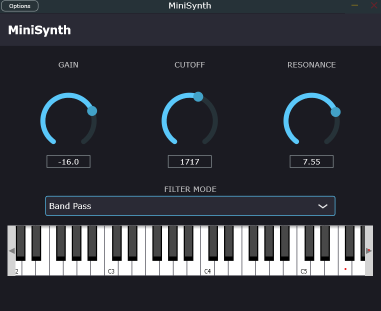

# MiniSynth

A polyphonic subtractive synthesiser built with JUCE, with a three-layer
automated test suite and CI on Windows and Linux.

**[Coverage dashboard →](https://app.codecov.io/github/udaiyan/minisynth)**

---

## What's here

A polyphonic subtractive synthesiser with:

- **8-voice polyphony** with round-robin voice stealing
- **Sine, saw, and square oscillators**
- **ADSR amplitude envelope**
- **State-variable filter** with low-pass, band-pass, and high-pass modes
- **4 automatable parameters** — gain, cutoff, resonance, filter mode
- **On-screen keyboard**, playable with mouse or QWERTY keys
- **Standalone and VST3** builds
- 

Built with JUCE 9 and C++17.

### Build

    cmake -B build -DCMAKE_BUILD_TYPE=Release
    cmake --build build --config Release --parallel

See [docs/SETUP.md](docs/SETUP.md) for full prerequisites.

### Test

    ctest --test-dir build -C Release --output-on-failure

---

## Testing

**45 tests across three layers**, running in under two seconds locally.
~91% line coverage on `src/`.

| Suite | Location | Tests | Runtime | Covers |
|---|---|---|---|---|
| Unit | `tests/unit/` | 30 | <1 s | `src/dsp` — oscillators, envelope, filter, voice, engine |
| Integration | `tests/plugin/test_plugin.cpp` | 8 | ~1 s | Parameters, state, buses, buffers, MIDI |
| Component | `tests/plugin/test_editor.cpp` | 7 | ~1 s | Layout, parameter bindings, dropdown, keyboard |

CI runs the full suite on **Windows and Linux** for every push and pull
request. Test results are attached to every run as JUnit XML artifacts.
Coverage is measured in a separate Linux job and published to
[Codecov](https://app.codecov.io/github/udaiyan/minisynth).

### Coverage

~91% line coverage on `src/`. Uncovered lines are predominantly in
`paint()` methods (rendering, verified manually) and host-notification
paths that require a running DAW.

Full breakdown: **[app.codecov.io/github/udaiyan/minisynth](https://app.codecov.io/github/udaiyan/minisynth)**

---

## Architecture

- `src/dsp/` — **Pure C++, no JUCE.** Fully unit-testable synthesis engine.
- `src/plugin/` — JUCE shell: parameters, editor, host integration.
- `tests/unit/` — Fast DSP tests. No JUCE, no plugin host, no message thread.
- `tests/plugin/` — JUCE integration and component tests.

### Why this structure

The synthesis engine in `src/dsp/` has no JUCE dependency. The plugin
links it; the tests link it; nothing else does.

This is a deliberate application of the **Humble Object** pattern -
push the logic into a plain class, and leave the framework class as a
thin shell. `MiniSynthProcessor::processBlock` reads parameters, loops
over samples, and writes a buffer. Everything it *does* is delegated to
`minisynth::SynthEngine` and the classes beneath it.

That split buys three things:

1. **Fast tests.** The DSP suite runs its 30 tests in under a second.
   No plugin host, no audio device, no message thread - just plain
   objects with plain state.

2. **Good failure messages.** An envelope test that fails is an envelope
   bug. A plugin test that fails could be any of ten things. Testing the
   layers separately means a red test names the layer it broke in.

3. **A fast feedback loop.** Changing the filter doesn't recompile JUCE.
   That matters more than it sounds - test suites don't die of being
   wrong, they die of being slow enough that people stop running them.

The cost is real: the glue is under-tested, and the plugin-level suite
exists specifically to cover it. See [docs/TESTING.md](docs/TESTING.md)
for the full strategy.

---

## Known limitations

Each of these is a conscious decision, documented rather than hidden.

- **Naive saw and square oscillators alias** at high frequencies.
  Band-limited synthesis (PolyBLEP) is the fix - tracked as MS-030.
- **No parameter smoothing** - fast cutoff moves can produce zipper
  noise. Tracked as MS-020.
- **Voice stealing clicks** rather than crossfading. Tracked as MS-031.
- **No velocity on the on-screen keyboard.** The engine handles
  velocity correctly; the component sends a fixed value.

See [ROADMAP.md](ROADMAP.md) for the full ticket list.

---

## Docs

- [Testing strategy](docs/TESTING.md) - layers, framework choice, conventions, what we deliberately don't test
- [AI-assisted test policy](docs/AI_ASSISTED_TESTS.md) - tooling, prompting standards, review discipline, quality thresholds
- [Setup](docs/SETUP.md) - prerequisites, platform quirks, common build failures
- [Roadmap](ROADMAP.md) - completed, in-flight, next, and deliberately-not-planned work

---

## Continuous integration

Three jobs run on every push and pull request to `main`:

| Job | OS | What it does |
|---|---|---|
| `build-and-test` | Windows | Release build, runs the full test suite |
| `build-and-test` | Linux | Release build, runs the full test suite under `xvfb` |
| `coverage` | Linux | Debug + `--coverage` build, publishes to Codecov |

JUCE and Catch2 are cached between runs, so a typical CI run takes
3–5 minutes rather than 15.

### Badges

- **CI** - build and test status on both platforms
- **Codecov** - line coverage from the latest `main` build

Both link through to the full report.

